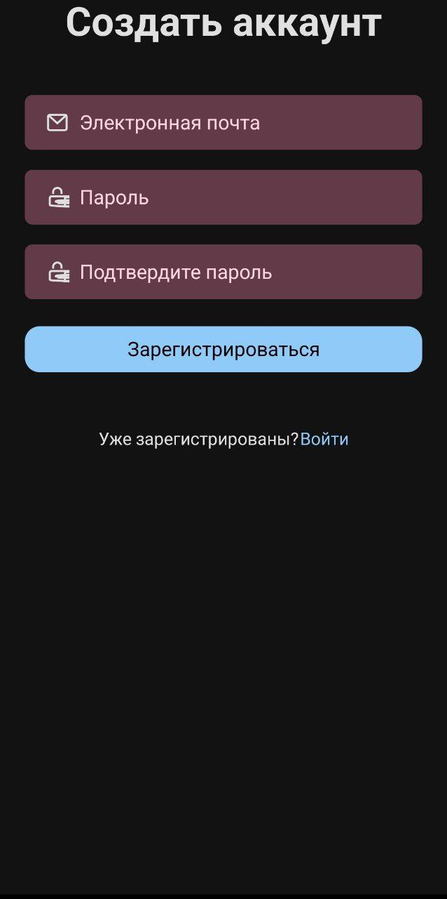
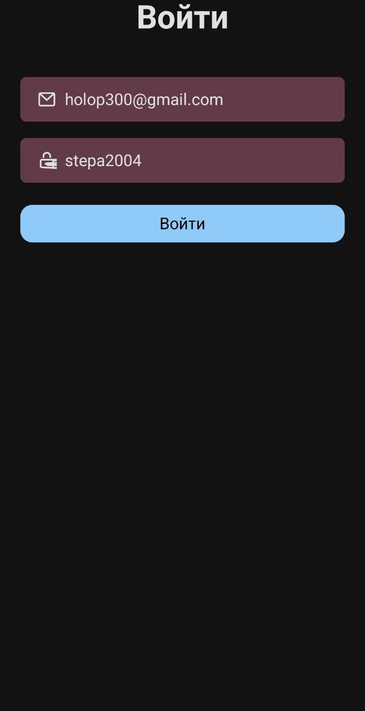
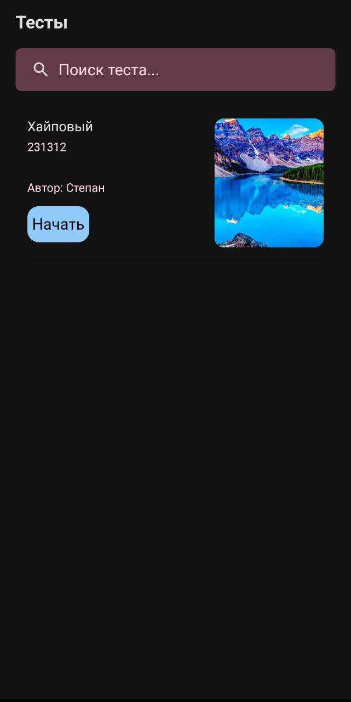
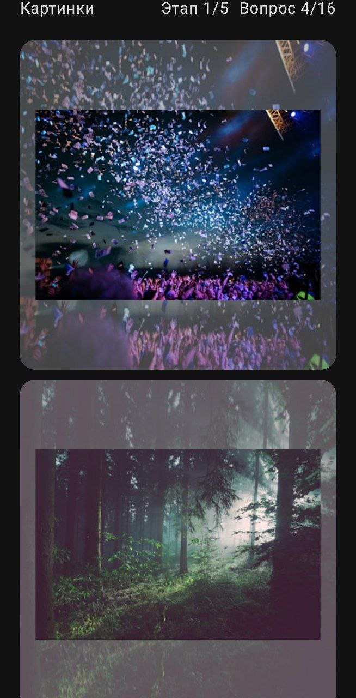
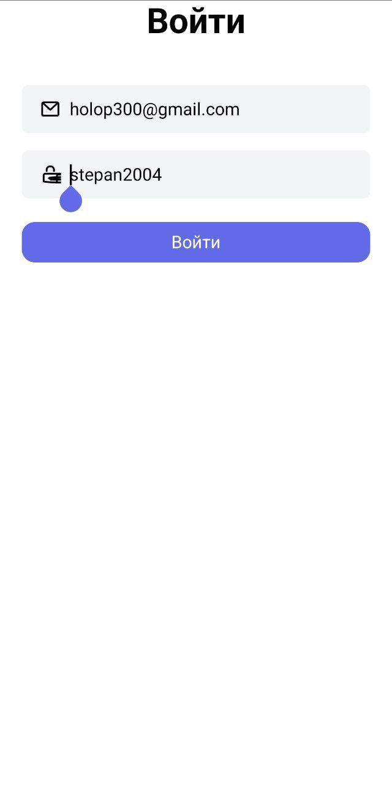

# Документация пользователя

Данная документация ориентирована на пользователей. Включает описание основных экраннов приложения и описание основных функций приложения.
## Навигация

- [Экран создания нового аккаунта](#экран-создания-нового-аккаунта)
- [Экран входа в аккаунт](#экран-входа-в=аккаунт)
- [Экран выбора теста](#экран-выбора-теста)
- [Экран прохождения теста](#экран-прохождения-теста)
- [Светлая тема](#светлая-тема)

---

## Экран создания нового аккаунта

> Для новых пользователей есть возможность создать аккаунт

---

## Экран входа в аккаунт

> Для пользователей с аккаунтом есть возможность войти уже в существуюший аккаунт

---

## Экран выбора теста

> На главном экране можно выбрать тест, у теста подписан автор и изображено его превью

---

## Экран прохождения теста

> Во время прохождения у пользователя отображается этап и номер вопроса

---

## Светлая тема

> Есть возможность переключиться на светлую тему через настройки

